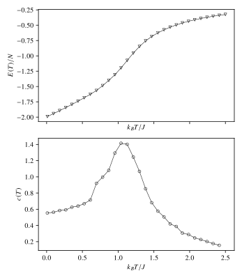

Specific heat of the two dimensional XY model
==============

The XY model is one of many, many models describing a lattice of interacting spins. Unlike the Ising model, it considers spins that may point along any direction in the plane. The Hamiltonian of this model is

$$H = -J \sum_{\langle i, j \rangle} \mathbf{s}_i \cdot \mathbf{s}_j = \sum _{\langle i, j \rangle}\cos(\theta_i - \theta_j)$$

where the sum is over all nearest neighbor pairs $i,j$, with each pair counted once. The XY model famously has a phase transition where bound vortex pairs dissociate above the critical temperature. It was named the BKT transition after Vadim Berezinskii, John Kosterlitz, and David Thouless.

In this short project, I tried to estimate $\langle E \rangle$ as a function of temperature for a 64 x 64 lattice with periodic boundary conditions, following [1]. For this model, the Metropolis-Hastings sampling procedure takes the following form (for a single update):

1. Choose a random number $\phi \sim \mathrm{Unif}(-\alpha, \alpha)$
2. Calculate the energy change $\Delta E$ when a particular spin $\theta_i$ is changed to  $\theta_i + \phi$
3. If $\Delta E \le 0$, then set $\theta_i \leftarrow \theta_i + \phi$.
   * Otherwise, if $\Delta E > 0$, set $\theta_i \leftarrow \theta_i + \phi$ with probability $\exp(-\beta \Delta E)$

When the algorithm is written in this suggestive way, one might suspect that it converges to the canonical ensemble no matter the initial state. In fact, this is true (if any state is reachable from any other).

Following [1], the implementation updates the whole lattice from left to right, then top to bottom. (this is called a "sweep"). The parameter $\alpha$ is updated after each sweep to bring the acceptance ratio close to 0.5, via
$$\alpha \leftarrow \alpha \times  (0.5 + \textrm{previous mean acceptance ratio})$$

although this seems not to work when $k_B T / J > 2$, because there is less local order. The sampling code is written in C++, but everything else is Python.

After random initialization, the system is set to a temperature of $T = 2.5 J/k_B$ and is allowed to burn in for 3000 sweeps. The energy is then averaged for 10000 sweeps (once per sweep) before the system is cooled to the next temperature, allowed to relax for 1000 sweeps, and so on. The following figure shows microstates sampled at a range of temperatures beginning above $T=2$ and ending at $T=0.01$.

Once averages of energy traces are obtained at 30 temperature points, the specific heat capacity can be approximated with a simple forward difference as
$$c(T) \approx \frac{E(T) - E(T - \Delta T)}{N \Delta T}$$
where $\Delta T$ is the spacing of the temperature grid and $N$ is the number of spins in the lattice.
Below I show plots of the average energy per spin and the specific heat capacity versus temperature. These plots agree qualitatively with [1], although neither the average energies nor the heat capacity estimates are an exact match. There is an interesting peak in the specific heat curve near $T=1$. It is not the BKT transition and I have not yet found an easy explanation for it in the literature.

## Room for improvement
I have not searched for more efficient sampling algorithms in the literature, although many must certainly exist. I also have not investigated the quantitative differences between these results and those of [1] and more modern calculations such as [2], and would not trust my code until these are understood.

## To run the code

After cloning this repository, type `pip install -e .` to set up the package in your Python environment.

Then you can run the sampling procedure with `python -m xymontecarlo.xymc`. This will generate the above figure if allowed to run to completion.

(Probably you should run `pip uninstall xymontecarlo` when you are done)

[1] Tobochnik, J.; Chester, G. V. Monte Carlo Study of the Planar Spin Model. *Physical Review B* **1979**, *20* (9), 3761–3769. https://doi.org/10.1103/physrevb.20.3761.

[2] Nguyen, P.H.; Boninsegni, M. Superfluid Transition and Specific Heat of the 2D x-y Model: Monte Carlo Simulation. *Appl. Sci.* **2021**, *11*, 4931. https://doi.org/10.3390/app11114931
